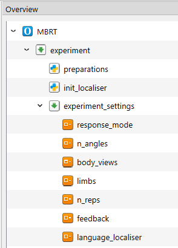
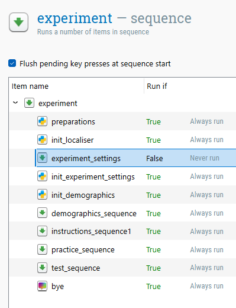

# MENTAL BODY ROTATION TASK (MBRT)

**Author:** Carla Czilczer, 18/12/2025  
**Software used:** OpenSesame 4.0.24  
**Experiment Type:** Local  
**Languages supported:** English (EN) = default, German (DE) (Spanish (ES) and French (FR) comming soon!). Further languages can be added, which requires simple changes in the code and updating the `.xlsx` files (see [language localization](#LANGUAGE-LOCALIZATION)). 

---------------------------------------
## GENERAL INSTRUCTIONS

This experiment is built using [OpenSesame]( https://osdoc.cogsci.nl/) 4.0.24. To run this experiment local, it utilizes the [xpyriment]( https://osdoc.cogsci.nl/4.1/manual/backends/) backend. Please check the version you are using, as older OpenSesame versions might crash. 
If you are unfamiliar with OpenSesame, please refer to the [documentation](osdoc.cogsci.nl) on their website. This README specifically details the structure and customization of this MBRT implementation.  

---------------------------------------
## SETUP INSTRUCTIONS

To edit or run this task locally, you need to have **OpenSesame** 4.0.24 or superior installed on the data collection computer.  
A script for data preparation in [R](https://www.r-project.org/) (4.5.2) is provided.  

**Step-by-step instructions:**  
1.	**Download** and unzip the repository (all files) to a dedicated folder with not other experiment files in it.
2.	**Open** the file `MBRT_local.osexp` in OpenSesame.
3.	If required: **Adapt** the [experiment settings](#available-parameters) and save them.
4.	Click the **green triangle** to run the experiment.
5.	For each run, **save** the corresponding `.csv` file in the `data` folder located inside the unzipped repository. **Do not rename the files.** The `data-prep.R` script requires the standard naming format `subject-<subject_nr>.csv` (e.g., `subject-1.csv`, `subject-2.csv`).
6.	 **Process the data** using the provided `data-prep.R` script.

---------------------------------------
## LANGUAGE LOCALIZATION

This experiment uses external `.xlsx` files to manage text and translations. This makes adding new languages relatively easy, but strict formatting rules apply.

**How it works:** Within the experiment, either a default language can be configured (see [changing defaults](#Changing-the-Defaults)), or participants can select their preferred language at the start (see [letting participants select settings](#Letting-Participants-Select-Settings)), otherwise, the default “English” is applied). The experiment uses the corresponding _ISO_code_ (e.g., "EN", "DE") to retrieve the corresponding text from columns in the external `.xlsx` files (e.g., `Instructions.xlsx`, `Block_messages.xlsx`).

## **Adding a new language:**
### 1. Open the relevant `.xlsx` files
- `Language_localiser.xlsx`
- `Demographics.xlsx`
- `Messages.xlsx`
- `Instructions.xlsx`
- `Block_messages.xlsx`
### 2. Extend `language_localiser-semicolon.xlsx` by adding a new row  
**| language | ISO_code |**
| :--- | :--- | 
| English | EN | 
| Spanish | ES | 
| German | DE | 
| French | FR |

Add your new language (e.g., Italian) by inserting the _language_ and _ISO_code_ in a **new row**:
**| language | ISO_code |** 
| :--- | :--- | 
| English | EN | 
| Spanish | ES | 
| German | DE | 
| French | FR |
| Italian | IT |

### 3. Extend the files `Demographics.xlsx`, `Messages.xlsx`, `Instructions.xlsx`, `Block_messages.xlsx` by adding a new column
Example: `Messages.xlsx`
| message | EN | ES | DE | FR |
| :--- | :--- | :--- | :--- | :--- |
| welcome_msg | Welcome to the experiment! | Bienvenido/a al experimento! | Willkommen zum Experiment! | Bienvenue dans l'expérience ! |
| adv_msg | Press SPACE to continue | Presiona ESPACIO para continuar | Drücken Sie die Leertaste um fortzufahren | Appuyez sur ESPACE pour continuer |
| bye_msg | You have finished the experiment | Has terminado el experimento | Sie haben das Experiment beendet | Vous avez terminé l'expérience |

Add a **new column** using the _ISO_code_ (`IT`), and enter translations at the end of each row:
| message | EN | ES | DE | FR | IT |
| :--- | :--- | :--- | :--- | :--- | :--- |
| welcome_msg | Welcome to the experiment! | Bienvenido/a al experimento! | Willkommen zum Experiment! | Bienvenue dans l'expérience ! | Benvenuti all'esperimento! |
| adv_msg | Press SPACE to continue | Presiona ESPACIO para continuar | Drücken Sie die Leertaste um fortzufahren | Appuyez sur ESPACE pour continuer | Premere lo SPAZIO per continuare |
| bye_msg | You have finished the experiment | Has terminado el experimento | Sie haben das Experiment beendet | Vous avez terminé l'expérience | Avete terminato l'esperimento |

⚠️Do this for each of the listed `.xlsx` files!

### 4. Update the experiment
1. Open the experiment file `MBRT_local.osexp`
2. Go to the **overview tab**
3. In the `experiment_sequence`, click on `language_localiser`
4. In the window with listed language names, add your new language name (e.g., `Italian`) in a new row — it must exactly match the entry in your `language_localiser.xlsx`

### 5. Reload the updated `.xlsx` files into the file pool
1. Open the file pool (folder icon with image) 
2. Click the **green plus** button
3. Select the updated `.xlsx` files you updated and upload them — they will replace the old ones
4. Save the experiment
---
> **⚠️ Important:** When editing the `.xlsx` files to add translations or change text, you **MUST use HTML tags** to format text directly. 

Common HTML tags used for this experiment:
* `<b>Text</b>` : Makes text **bold**.
* `<br>` : Inserts a line break (new line).
* `<i>Text</i>` : Makes text *italic*.
* `<span style='color:red'>Text</span>` : Changes text color.

If you do not use HTML tags, the formatting will not appear correctly in the experiment.  
When adding a new language, you must manually insert line breaks using `<br>` within the cell. Otherwise, longer instructions will be truncated.

> **⚠️ Important:** You must **MUST NOT** change the names of the folders or files, as this will cause the experiment to crash. Additionally, do not change any variable names; the experiment logic depends on these specific identifiers, and renaming them requires updating the underlying code. Do not move files after decompressing the repository. Any deviation from the original file structure or naming will lead to a crash.


_For more information on how to implement a language localizer in OpenSesame, see this [Language Localisation Demo](https://github.com/carlacz/OpenSesame_Language-Localisation-Demo/edit/main/Language_localiser_local)._

---------------------------------------
## TECHNICAL DETAILS
The decompressed repository includes the following files and subfolders:
* `MBRT_local.osexp`: The main experiment file; needed to change the experiment settings.
* `Language_localiser.xlsx`: Configuration files for language selection (language + ISO code).
* `Demographics.xlsx`: Questions and translations for the demographics form.
* `Messages.xlsx`: General messages not specific to task instructions (e.g., welcome, advance, wrong key, goodbye).
* **Folder** `mbrt_files`:
    * `Instructions.xlsx`: Main task instructions.
    * `Block_messages.xlsx`: Text displayed between experimental blocks (break screens).
    * `Stimuli_[...].xlsx`: Loop files controlling the trial sequence. These are dynamically called depending on the number of repetitions and angles selected (e.g., `Stimuli_4angles_all.xlsx`, `Stimuli_6angles_def_all.xlsx`, etc.).
* **Folder** `mbrt_images`: `.png` files for all visual stimuli.
* **Folder** `data`: Empty folder designated for storing the `.csv` files (one per participant/run). 
* `data-prep.R`: R script that reads in all `.csv` files automatically, generates `data.rdata` file and stores it in the `data` folder. `data.rdata` contains the testblock data in long format and demographic data in wide format.

---------------------------------------
## EXPERIMENT SETTINGS (parameters to choose)
The experiment file allows you to customize various settings. In the **Overview** tab, under the item `experiment_settings`, you will find the following variables that can be modified:


By default, **the experimenter will set these settings** via dialog boxes **at the beginning of each run**.  

### Available Parameters
| Variable | Options | Description |
| :--- | :--- | :--- |
| `response_mode` | • **both hands** (Default)<br>• left hand<br>• right hand | Determines the required input method. |
| `n_angles` | • **6** (0°, 45°, 135°, 180°, 225°, 315°) (Default)<br>• 4 (increments of 90°)<br>• 6 (increments of 60°)<br>• 8 (increments of 45°)<br>• 12 (increments of 30°) | Sets the number and type of rotation angles presented. |
| `body_views` | • **front and back** (Default)<br>• front<br>• back | Determines which body orientations are shown. |
| `limbs` | • **arms and legs** (Default)<br>• arms<br>• legs | Determines which limbs are rotated. |
| `n_reps` | • **1** (Default)<br>• 4<br>• 8<br>• 12 | The number of times each unique stimulus is repeated. |
| `feedback` | • **0.3** (Default)<br>• 0.5<br>• 0.8<br>• 1<br>• No feedback | Duration of feedback (in seconds) per trial in the test blocks. |
| `language_localiser`| • **English** (Default)<br>• German | Sets the default language for the experiment. |

### Disable Parameter Selection 
Instead of selecting the experiment settings at the beginning of each run, it is possible to **hard-code defaults** and **disable the manual selection** of specific (or all) settings:

In OpenSesame, you can **disable specific sequences or items** by clicking on the parent sequence in the Overview tab. 
In the tab that opens on the right, you will see a **Run if** statement next to each item. Set this statement to `False` instead of `True` to disable it. If you disable the whole `experiment_settings` sequence within the `experiment` sequence (see below), the **Default settings** listed in the table above will be used. 
 

### Changing the Defaults 
You can also **change the defaults** by hard-coding new values within the script.  
To do this: 
1. Go to the **Overview** tab. 
2. Click on the `preparations` inline script. 
3. Modify lines **17–26** to your desired values. 
You **MUST NOT** modify any other lines in the script! 

> **⚠️ Important:** If you change the default language, you must update **four** related variables to match the ISO codes found in `Language_localiser.xlsx`. You must update: `selected_language`, `ISO_code`, `selected_ISO`, and `selected_ISO_low`. 

**Example configuration:**
```python
selected_language = "German"
ISO_code = "DE"
selected_ISO = "de"
selected_ISO_low = "de"

selected_response_mode = "Both hands"
selected_feedback = "0.8"
selected_n_angles = "6 (0°, 45°, 135°, 180°, 225°, 315°)"
selected_body_views = "Front and Back"
selected_limbs = "Arms and Legs"
selected_n_reps = 1;
```

Instead of disabling the whole `experiment_settings` sequence, you can also set defaults for specific settings only. For instance, if your whole sample is German-speaking, you can hard-code the language default in the `preparations` inline script (see above) and disable only the `language_localiser` item (see below).


### Disable Demographic Questions
The experiment includes three demographic questions (Age, Sex, Handedness) by default. We incorporate these questions to facilitate the **creation of norms** that will facilitate the interpretation of individual scores.  

**We welcome contributions to this initiative!** If you wish to submit your data, please follow the steps outlined on the [platform website](link). When uploading data from specific populations (e.g., stroke patients), please ensure you provide the necessary context.
If you do not wish to contribute, you can disable the demographic questions. 
1.  Click on the `experiment` item in the Overview tab.
2.  Locate the `demographics_sequence` in the tab to the right. 
3.  Change the corresponding “Run if” from “True” to “False”.

### Saving
To try out the experiment after changing settings or adding a new language, click on the blue play button. (This mode is **not** suitable for data collection, only for debugging!)

Once you have finished your configuration, you must **save** the experiment.

---------------------------------------
## PARTICIPANT WORKFLOW:
The participant workflow starts after the experimenter selected the experiments settings (if not disabled).
1.  **Demographics:** Participants complete a basic form (Age, Sex, Handedness).
2.  **Instructions:** Detailed explanation of the task and assignment of response keys.
3.  **Practice Block:** A short series of trials (0° rotation) with feedback to familiarize participants with the key mapping.
4.  **Test Blocks:** The main experimental trials; for _n_reps_ > 1, divided into 4 blocks with breaks in between.
5.  **Completion:** Final "Goodbye" screen.

#### MBRT trial procedure
The sequence of a single trial is as follows:
1.  **Fixation dot:** Presented for 1000 ms.
2.  **Stimulus presentation:** Stays on screen until a keypress is recorded.
3.  **Feedback:** (Conditional) If enabled, feedback is shown for the selected duration.  
    *→ Automatic advance to the next trial.*

---------------------------------------
## OUTPUT
For **each run**, a `.csv` file is created with the standard naming format `subject-<subject_nr>.csv`. Store these `.csv` files in the dedicated `data` folder located inside the unzipped repository. Do not rename them to be able to automatically read in all `.csv` files in the `data-prep.R` script.  
The provided `data-prep.R` script is designed to read all `.csv`  files, extract relevant observations from the test blocks, and save the processed data as `data.rdata` in the `data` folder.

**To run the data preparation**, open `data-prep.R` and **source** the script.

The script will generate `data.rdata`, which contains two dataframes: `data_long_tbl` (trial-level data) and `data_wide` (demographics).

> **Note:** This script relies on the standard experiment structure. If modifications were made beyond the configurable [Experiment Settings](#available-parameters), the code may need adaptation. Additionally, raw data should always be inspected and cleaned of outliers or errors prior to statistical analysis.

### Variable Documentation

#### 1. Testblock Trials Data (`data_long_tbl`)
*Contains one row per trial (filtered to test blocks).*

| Variable Name | Type | Description |
| :--- | :--- | :--- |
| `subject_nr` | factor | Participant ID. |
| `phase` | character | Experiment phase (e.g., "MBRT_testblock"). |
| `n_testbl` | integer | Test block index (1-4 if >1 repetitions selected). |
| `n_trial` | integer | Trial index (within the test phase). |
| `correct` | integer | Correctness flag (1 = correct, 0 = incorrect). |
| `solution` | character | Correct response code for the trial (e.g., "s", "g", "l", "h"). |
| `mbrt_angle` | numeric | Stimulus rotation (degrees). |
| `mbrt_limb` | factor | Limb shown (e.g., "arm", "leg"). |
| `mbrt_side` | factor | Laterality ("left", "right"). |
| `mbrt_view` | factor | View ("front", "back"). |
| `RT` | numeric | Response time in milliseconds (ms). |
| `trial_response` | character | Key pressed / response code (participant response). |

#### 2. Demographic Data (`data_wide`)
*Contains one row per subject (if demographics were enabled).*

| Variable Name | Type | Description |
| :--- | :--- | :--- |
| `subject_nr` | character | Participant ID. |
| `age` | integer | Participant age in years. |
| `sex` | character | Participant sex ("f" = female, "m" = male, "d" = diverse). |
| `handedness` | character | Participant handedness ("l" = left, "r" = right). |

-----

OpenSesame version updates might require adjustments in the experiment file.  
As developers, we are not responsible to implementing the task in every use case.  
Feel free to contribute!

-------
## REFERENCE
Please cite [Czilczer et al. (2025)](DOI) when using this resource.
