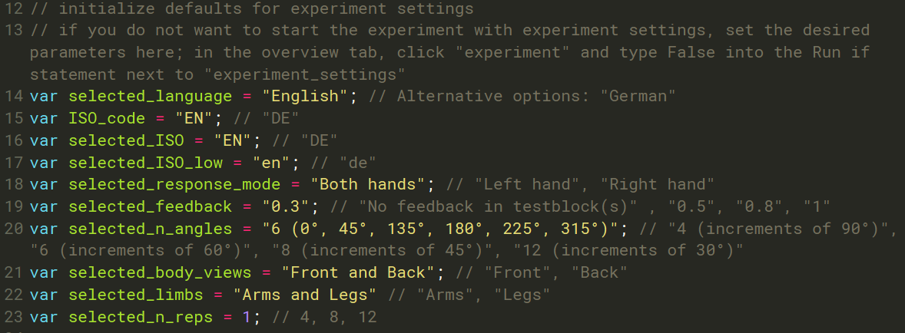
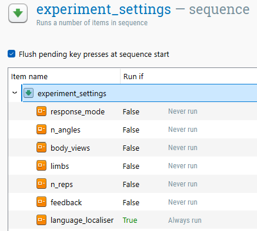

# MENTAL BODY ROTATION TASK (MBRT)

**Author:** Carla Czilczer, 12/12/2025  
**Software used:** OpenSesame 4.0.2  
**Experiment Type:** Online  
**Languages supported:** English (EN) = default, German (DE), Spanish (ES), French (FR). Further languages can be added, which requires simple changes in the code and updating the `.csv` files (see [language localization](#LANGUAGE-LOCALIZATION)). 

---------------------------------------
## GENERAL INSTRUCTIONS

This experiment is built using [OpenSesame](osdoc.cogsci.nl). To run this experiment online, it utilizes the [OSWeb](https://osdoc.cogsci.nl/4.1/manual/osweb/osweb/) backend.  
If you are unfamiliar with OpenSesame, please refer to the [documentation](osdoc.cogsci.nl) on their website. This README specifically details the structure and customization of this MBRT implementation.  

---------------------------------------
## SETUP INSTRUCTIONS

To edit or run this this task locally, you need to have **OpenSesame** installed.  
To run the task online, you will likely need a [JATOS server]( https://www.jatos.org/). At the time of writing, [MindProbe](https://mindprobe.eu/) serves as a JATOS server free of charge.  
A script for data preparation in [R](https://www.r-project.org/) (4.5.2) is provided.  

**Step-by-step instructions:**  
1.  **Download** and unzip the repository to a dedicated folder.
2.  Log in to your JATOS server (e.g., [JATOS sign-in in Mindprobe](https://jatos.mindprobe.eu/jatos/signin)), click ”**Import Study**”, and select the `.jzip` file (this is the experiment file).
3.  Name and click on the study to **open the dashboard**.
4.  Click on “Study Links”, **choose** your preferred study link type (e.g., Personal Single Link, General Multiple Link, MTurk), click on the “Study Link” button next to it and **copy the URL**.
5.  **Distribute** the generated link(s) to your participants. They run the task directly in their web browser.
6.  To **export data**, navigate in JATOS to “Results” ➝ “Export Results”. Select “Data only” ➝ “Plain Text” and save the `.txt` file into the `data` folder located inside the unzipped repository.
7.  **Process the data** using the provided `.R` script.

---------------------------------------
## LANGUAGE LOCALIZATION

This experiment uses external `.csv` files to manage text and translations. This makes adding new languages relatively easy, but strict formatting rules apply.

**How it works:** Within the experiment, either a default language can be configured (see [changing defaults](#Changing-the-Defaults)), or participants can select their preferred language at the start (see [letting participants select settings](#Letting-Participants-Select-Settings)), otherwise, the default “English” is applied). The experiment uses the corresponding _ISO_code_ (e.g., "EN", "DE") to retrieve the corresponding text from columns in the external `.csv` files (e.g., `Instructions.csv`, `Block_messages.csv`).

## **Adding a new language:**
### 1. Open the relevant `.csv` files
- `Language_localiser.csv`
- `Demographics.csv`
- `Messages.csv`
- `Instructions.csv`
- `Block_messages.csv`
### 2. Extend `language_localiser-semicolon.csv` by adding a new row  
```
language;ISO_code
English;EN
Spanish;ES
German;DE
French;FR
```

Add your new language (e.g., Italian) by inserting the _language_ and _ISO_code_ in a **new row**:
```
language;ISO_code
English;EN
Spanish;ES
German;DE
French;FR
Italian;IT
```
### 3. Extend the files `Demographics.csv`, `Messages.csv`, `Instructions.csv`, `Block_messages.csv` by adding a new column
Example: `Messages.csv`
```
message;EN;ES;DE;FR
welcome_msg;Welcome to the experiment!;Bienvenido/a al experimento!;Willkommen zum Experiment!;Bienvenue dans l'expérience !
adv_msg;Press SPACE to continue;Presiona ESPACIO para continuar;Drücken Sie die Leertaste um fortzufahren;Appuyez sur ESPACE pour continuer
bye_msg;You have finished the experiment;Has terminado el experimento;Sie haben das Experiment beendet;Vous avez terminé l'expérience
```

Add a **new column** using the _ISO_code_ (`IT`), and enter translations at the end of each row:
```
message;EN;ES;DE;FR;IT
welcome_msg;Welcome to the experiment!;Bienvenido/a al experimento!;Willkommen zum Experiment!;Bienvenue dans l'expérience !;Benvenuti all'esperimento!
adv_msg;Press SPACE to continue;Presiona ESPACIO para continuar;Drücken Sie die Leertaste um fortzufahren;Appuyez sur ESPACE pour continuer;Premere lo SPAZIO per continuare
bye_msg;You have finished the experiment;Has terminado el experimento;Sie haben das Experiment beendet;Vous avez terminé l'expérience;Avete terminato l'esperimento
```

⚠️Do this for each of the listed `.csv` files!


### 4. Update the experiment
1. Open the experiment file `MBRT_OpenSesame_online.osexp`
2. Go to the **overview tab**
3. In the `experiment_sequence`, click on `language_localiser`
4. In the window with listed language names, add your new language name (e.g., `Italian`) in a new row — it must exactly match the entry in your `language_localiser.csv`

### 5. Reload the updated `.csv` files into the file pool
1. Open the file pool (folder icon with image) 
2. Click the **green plus** button
3. Select the updated `.csv` files you updated and upload them — they will replace the old ones
4. Save the experiment

### 6. Export experiment as `.jzip`
In OpenSesame, open the OSWeb extension (“Tools” in the top bar → “OSWeb and JATOS control panel”), and click on “Export to JATOS archive”. This saves a new `.jzip` file that you then upload to your JATOS server.  

#### ⚠️ Critical: Text formatting in `.csv` files
When editing the `.csv` files to add translations or change text, you **MUST use HTML tags** to format text directly. **DO NOT** use Enter for a linebreak.   

Common HTML tags used for this experiment:
* `<b>Text</b>` : Makes text **bold**.
* `<br>` : Inserts a line break (new line).
* `<i>Text</i>` : Makes text *italic*.
* `<span style='color:red'>Text</span>` : Changes text color.  
If you do not use HTML tags, the formatting will not appear in the online experiment.  
When adding a new language, you must manually insert line breaks using `<br>` within the cell. Otherwise, longer instructions will be truncated. **Do not use the "Enter" key**, as this causes rendering errors and text misalignment during the experiment.  

#### ⚠️ Critical: Names of folders, files and variables
You must **MUST NOT** change the names of the folders or files, as this will cause the experiment to crash. Additionally, do not change any variable names; the experiment logic depends on these specific identifiers, and renaming them requires updating the underlying code. Do not move files after decompressing the repository. Any deviation from the original file structure or naming will lead to a crash.

---
For more information, see this [Language Localisation Demo]( https://github.com/carlacz/OpenSesame_Language-Localisation-Demo/edit/main/Language_localiser_online/README.md)

---------------------------------------
## TECHNICAL DETAILS
The decompressed repository includes the following files and subfolders:
* `MBRT_OpenSesame_online.osexp`: The main experiment file.
* `Language_localiser.csv`: Configuration files for language selection (language + ISO code).
* `Demographics.csv`: Questions and translations for the demographics form.
* `Messages.csv`: General messages not specific to task instructions (e.g., welcome, advance, wrong key, goodbye).
* **Folder** `mbrt_files`:
    * `Instructions.csv`: Main task instructions.
    * `Block_messages.csv`: Text displayed between experimental blocks (break screens).
    * `Stimuli_[...].csv`: Loop files controlling the trial sequence. These are dynamically called depending on the number of repetitions and angles selected (e.g., `Stimuli_4angles_all.csv`, `Stimuli_6angles_def_all.csv`, etc.).
* **Folder** `mbrt_images`: `.png` files for all visual stimuli.
* **Folder** `data`: Empty folder designated for storing the `.txt` file exported from JATOS.

---------------------------------------
## EXPERIMENT SETTINGS (parameters to choose)
The experiment file allows you to customize various settings. In the **Overview** tab, under the item `experiment_settings`, you will find the following variables that can be modified:


### Available Parameters

| Variable | Options | Description |
| :--- | :--- | :--- |
| `response_mode` | • **both hands** (Default)<br>• left hand<br>• right hand | Determines the required input method. |
| `n_angles` | • **6** (0°, 45°, 135°, 180°, 225°, 315°) (Default)<br>• 4 (increments of 90°)<br>• 6 (increments of 60°)<br>• 8 (increments of 45°)<br>• 12 (increments of 30°) | Sets the number and type of rotation angles presented. |
| `body_views` | • **front and back** (Default)<br>• front<br>• back | Determines which body orientations are shown. |
| `limbs` | • **arms and legs** (Default)<br>• arms<br>• legs | Determines which limbs are rotated. |
| `n_reps` | • **1** (Default)<br>• 4<br>• 8<br>• 12 | The number of times each unique stimulus is repeated. |
| `feedback` | • **0.3** (Default)<br>• 0.5<br>• 0.8<br>• 1<br>• No feedback | Duration of feedback (in seconds) per trial in the test blocks. |
| `language_localiser`| • **English** (Default)<br>• German | Sets the default language for the experiment. |

> **Note:** If you import the provided `.jzip` file directly to the JATOS server without edits, the **Default** settings (bolded above) will be used.

### Changing the Defaults
You can hard-code new default settings within the script. To do this:
1.  Go to the **Overview** tab.
2.  Click on the `preparations` inline script.
3.  Modify lines 12–24 to your desired values.



> **⚠️ Important:** If you change the default language, you must update **four** related variables to match the ISO codes found in `Language_localiser.csv`. You must update: `selected_language`, `ISO_code`, `selected_ISO`, and `selected_ISO_low`.

**Example configuration:**
```javascript
var selected_language = "German";
var ISO_code = "DE";
var selected_ISO = "de";
var selected_ISO_low = "de";

var selected_response_mode = "Both hands";
var selected_feedback = "0.8";
var selected_n_angles = "6 (0°, 45°, 135°, 180°, 225°, 315°)";
var selected_body_views = "Front and Back";
var selected_limbs = "Arms and Legs";
var selected_n_reps = 1;
```

### Letting Participants Select Settings
You can allow participants to choose specific settings themselves (e.g., their preferred language) at the beginning of the experiment.

1.  Click on the `experiment_settings` item in the Overview tab.
2.  Locate the setting you want the participant to control.
3.  Change the **"Run if"** statement for that setting from `False` to `True`.

  
In the above example, participants will be asked to select their preferred language at the start of every run.

### Saving and Exporting
To try out the experiment after changing settings or adding a new language, click on the blue play button. (This mode is **not** suitable for data collection, only for debugging!)

Once you have finished your configuration, you must export the experiment for online use:

1.  **Save** the experiment in OpenSesame.
2.  **Export** as `.jzip`: In OpenSesame, open the OSWeb extension (“Tools” in the top bar → “OSWeb and JATOS control panel”), and click on “Export to JATOS archive”.  
3.  This creates a new `.jzip` file. You can now **upload** this file to your JATOS server.

---------------------------------------
## PARTICIPANT WORKFLOW:

1.  **Settings Selection:** (Conditional) If specific `Run if` statements are set to `True`, participants first select their preferred settings (e.g., Language).
2.  **Demographics:** Participants complete a basic form (Age, Sex, Handedness).
3.  **Instructions:** Detailed explanation of the task and assignment of response keys.
4.  **Practice Block:** A short series of trials (0° rotation) with feedback to familiarize participants with the key mapping.
5.  **Test Blocks:** The main experimental trials.
    * *Note:* If `n_reps` > 1, the task is automatically divided into 4 blocks with breaks in between.
6.  **Completion:** Final "Goodbye" screen.

#### MBRT trial procedure
The sequence of a single trial is as follows:
1.  **Fixation dot:** Presented for 1000 ms.
2.  **Stimulus presentation:** Stays on screen until a keypress is recorded.
3.  **Feedback:** (Conditional) If enabled, feedback is shown for the selected duration.
    * *→ Automatic advance to the next trial.*

---------------------------------------
## OUTPUT
Following step 6 in the setp-by-step [setup instructions](#SETUP-INSTRUCTIONS), the data is exported as a single `.txt` file containing all participant responses in long format.  
The provided `.R` script (`data-preparation.R`) is designed to read this raw JATOS export, extract relevant observations from the test blocks, and save the processed data as `data.rdata`. Please note that this script relies on the standard experiment structure; if modifications were made beyond the configurable Experiment Settings, the code may need adaptation. Additionally, raw data should always be inspected and cleaned of outliers or errors prior to statistical analysis.

**Key Variables for Analysis:**
* `response_time` (or `time_response_keyboard`): Reaction time in milliseconds.
* `correct`: Accuracy (1 = correct, 0 = incorrect).
* `mbrt_angle`: The angle of rotation.
* `mbrt_side`: The laterality of the stimulus (Left/Right).
* `mbrt_view`: The perspective (Front/Back).
* `count_block`: The current block number.
…

